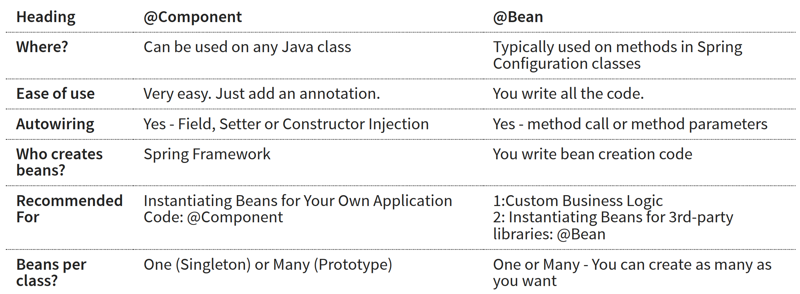
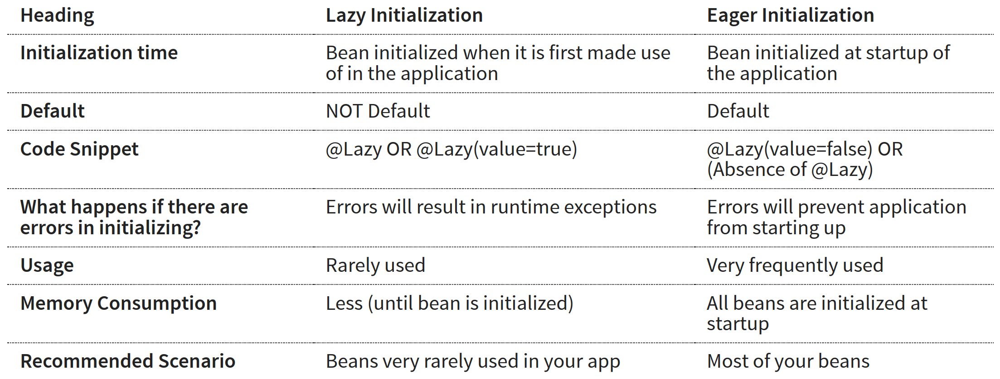
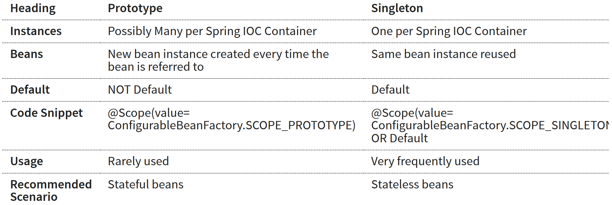

# 코어

_<mark style="background-color:yellow;">Tight coupling and Loose coupling?</mark>_

결합도는 좋은 소프트웨어를 만드는데 매우 중요한 개념입니다. 이는 소프트웨어 컴포넌트나 모듈 내부의 요소들이 얼마나 밀접하게 연결되어 있는지를 말합니다. 높은 결합도는 한 요소의 변경이 다른 요소에 큰 영향을 미치는 것을 의미합니다. 반면에 낮은 결합도는 한 요소의 변경이 다른 요소에 미치는 영향이 적다는 것을 의미합니다.


결합도는 실제 생활과 큰 연관이 있습니다. 예시를 한번 들어볼게요.

* 자동차에서 엔진은 매우 중요한 부품으로 조립하기가 어렵습니다. 반면에 바퀴는 매우 쉽게 붙였다 뗄 수 있습니다.
* 노트북은 장소구분없이 들고 다닐 수 있지만, 데스크탑은 그럴 수 없습니다.


&#x20;개발을 하면 알겠지만, 비지니스에도 변화가 있을 수 있고 프레임 워크, 코드등 모든 것이 변경될 수 있습니다. <mark style="color:blue;">가능한 코드를 적게 변경하면서 기능을 변경</mark>할 수 있어야합니다. 왜냐하면 모듈의 내부 구성 요소가 서로 강하게 결합되어 있으면 코드를 이해하거나 수정하기 어렵고 유지보수가 어려워집니다. 따라서 가능한 느슨한 결합을 사용해야합니다.&#x20;


자바에서는 인터페이스를 사용하여 강한 결합을 느슨한 결합으로 만들 수 있습니다. 인터페이스를 중간에 넣음으로서 각 모듈의 의존성을 하나로 만들어 독립적으로 변경할 수 있게 됩니다.


_<mark style="background-color:yellow;">Dependency Injection</mark>_

의존성 주입이란 클래스간 의존성을 연결하는 행위를 말합니다.&#x20;

```java
// Object creation
var game = new PacmanGame();

// Object creation + Wiring of dependencies
// game is a dependency of gameRunner
var gameRunner = new GameRunner(game);
```


의존성 주입의 방법은 크게 3가지로 나뉩니다.

* Construct-based
* Setter-based
* Field

```java
@Component
class MyApp {

    // Field, @AutoWired 필수 
    @AutoWired
    private Dependency1 dependency1;
    
    @AutoWired
    private Dependency2 dependency2;

    // Setter-based, @AutoWired 필수
    @AutoWired
    public void setDependency1(Dependency1 dependency) {
        this.dependency1 = dependency;
    }
    
    @AutoWired
    public void setDependency2(Dependency2 dependency) {
        this.dependency2 = dependency;
    }
    
    // Construct-based, @AutoWired 옵션
    public MyApp(Dependency1 dependency1, Dependency2 dependency2) {
        super();
        this.dependency1 = dependency1;
        this.dependency2 = dependency2;
    }
}
```


_<mark style="background-color:yellow;">어떤 방식을 사용해야하는 걸까요?</mark>_ \
_<mark style="background-color:yellow;">의존성 주입이 스프링에서 왜 이렇게 강조되는 것일까요?</mark>_

스프링 팀은 생성자 방식의 의존성 주입을 추천합니다. 객체 생성과 동시에 초기화할 수 있어 안전하고, @AutoWired 어노테이션을 선언할 필요가 없기 때문입니다.


Real World 어플리케이션의 경우, 상당히 복잡한 구성으로 되어있습니다. 수백개의 클래스간의 의존성을 일일히 다루는 것은 쉽지 않은 일입니다. 따라서, 객체의 생성 및 의존성 연결 및 생명 주기 관리는 스프링 프레임워크에게 넘기고 프로그래머는 비지니스로직에만 집중할 수 있습니다.&#x20;


_<mark style="background-color:yellow;">대규모 어플리케이션의 경우, 수천개의 의존성이 생성되며 필요한 곳에 주입됩니다. 이러한 행동을 일일히 수동으로 하는 것보다, Spring 프레임워크에게 위임할 수 없을 까요?</mark>_

@Configuration , @Bean을 통해 스프링에게 위임할 수 있습니다.&#x20;

스프링에서 관리하는 일(자바 객체 : Spring Bean)들을 정의하는 클래스를 Configuration Class라고 합니다.

```java
// 1. Launch Spring Context.
// 2. Configure the things that Spring frameworks to manage.
var context = new AnnotaionConfigApplicationContext(configuration.class)
System.out.println(context.getBean(""))
```


_<mark style="background-color:yellow;">IOC Container?</mark>_ \
_<mark style="background-color:yellow;">Spring Container vs Spring Context vs IOC Container vs Application Context?</mark>_

<mark style="color:blue;">스프링 컨테이너는 Spring Beans와 Life cycle를 관리</mark>합니다. 즉 애플리케이션의 객체 생성과 관리를 자동화하는 도구입니다. 미리 정의한 자바클래스(POJOs)들과 환경설정(config)들을 인풋으로 받아 스프링 프레임워크 런타임 시스템을 구성합니다. 객체를 생성하고 필요한 객체에 자동으로 의존성을 주입하기 때문에 개발자가 객체 간의 의존성을 직접 관리할 필요가 없습니다 :)


```
🔍 IOC(제어의 역전)는 프로그래밍에서의 제어 흐름에 대한 개념입니다. 

일반적으로 객체지향 프로그래밍에서는 프로그래머가 객체 간의 관계를 직접 코드로 구현합니다. 이러한 경우 객체가 다른 객체를 생성하거나, 다른 객체의 메서드를 호출하는 등의 제어 흐름이 객체 내부에 결합되어 있습니다.

하지만 스프링에서는 프로그래머는 @Component, @AutoWired와 같은 어노테이션만 추가했을 뿐 실제 생성과 연결에 대한 것은 스프링에서 수행하게 만듭니다. 제어권이 프로그래머에서 프레임워크로 넘어갔다고 말할 수 있습니다. 이를 제어의 역전이라고 합니다.

제어의 역전은 이러한 객체 간의 결합도를 낮추기 위해, 객체 간의 관계를 외부에서 결정하도록 하는 것을 의미합니다. 즉, 객체가 자신이 사용할 객체를 직접 생성하거나 관리하지 않고, 이를 외부에 위임하는 것입니다. 이를 통해 객체 간의 결합도가 낮아지므로 유지보수와 테스트가 더 쉬워지는 장점이 있습니다.
```



_<mark style="background-color:yellow;">Bean Factory vs Application Context?</mark>_

스프링 컨테이너의 유형은 2가지로 나뉠 수 있습니다. Bean Factory는 디폴트 스프링 컨테이너를 말하고 Application Context는 엔터프라이즈급에서 다룰 수 있는 고급 기능을 포함하는 스프링 컨테이너 입니다.


```
🔍 현대적인 웹 어플리케이션의 경우, AOP등 고급 기능을 사용하므로 Application Context를 자주 사용합니다. 웹 어플리케이션, 웹 서비스, Restful API, 마이크로 서비스에서 사용할 수 있습니다. Bean factory를 사용하는 경우는 메모리 사용에 극심한 제약이 있는 IoT 앱뿐입니다.
```



&#x20;_<mark style="background-color:yellow;">POJOs vs Java Bean vs Spring Bean?</mark>_

Java Bean(EJB) : 3가지 제약을 준수하는 클래스

* public no-args constructor
* getter, setter
* serializable

POJOs : 아무 제약이 없는 일반적으로 흔히 사용하는 기본 자바 객체

Spring Bean : IOC Container가 관리하는 모든 객체


_<mark style="background-color:yellow;">스프링 컨테이너가 관리하는 객체 모두 출력하는 방법?</mark>_

```java
Array.stream(context.getBeanDefinitionNames())
    .forEach(System.out::println)
```


_<mark style="background-color:yellow;">AutoWiring?</mark>_\
_<mark style="background-color:yellow;">매칭 된 스프링민이 여러개일 경우?</mark>_

* @Primary  : 빈에 우선순위 부여, 기본 자동 연결
* @Qualifier : @Primary를 무시하고 특정 빈에 강제적으로 자동 연결

```java
@Component @Primary
class QuickSort implements SortingAlgorithm { }

@Component
class BubbleSort implements SortingAlgorithm { }

@Component @Qualifier("RadixSortQulifier")
class RadixSort implements SortingAlgorithm { }

// 여러개의 빈 후보군 중, 하나를 우선적으로 연결
@Component 
class ComplexAligorithm
    @AutoWired
    private SoortingAlgorithm algorithm;
    
// 오직 하나의 빈을 연결
@Component 
class ComplexAligorithm2
    @AutoWired @Qualifier("RadixSortQulifier")
    private SoortingAlgorithm algorithm;

```


_<mark style="background-color:yellow;">지금까지는 의존성이 필요하다면 개발자가 직접 @Bean을 등록했었습니다.</mark>_\
_<mark style="background-color:yellow;">스프링이 자동으로 객체를 생성해서 의존성을 주입할 수는 없을까요?</mark>_

작성되었던 @Bean을 삭제하고 @Component를 추가하여 스프링이 자동생성할 수 있도록 변경하였습니다.

```java
// in @Configuration class
// @Bean
// public game() {
//    return new PackmanGame()
// }

@Bean
public gameRunner(GamingConsle game) {
    return new GameRunner(game);
}

// in POJOs
@Component
public class PackmanGame() implements GamingConsle {
    // ...
}
```


하지만, NoSearchBeanDefinitionException 발생합니다. 스프링이 정의된 컴포넌트를 찾을 수 없기때문에 발생하는 문제입니다. 따라서 @ComponentScan 을 추가하여 해당 위치를 알려주어 문제를 해결합니다.

```java
@Configuration
@ComponentScan("path:package")
```


수동으로 객체를 생성하지 않고 스프링 프레임워크가 자동으로 생성해줄 수 있습니다. 이를 통해 상당량의 코드를 줄일 수 있게 됩니다. <mark style="color:blue;">스프링은 @Bean을 통해 객체를 관리하고 @AutoWiring을 수행할 뿐아니라 @Component와 @ComponentScan을 통해 필요한 객체를 패키지에서 찾고 객체를 생성하여 전체 애플리케이션을 정상적으로 작동시켜 줍니다.</mark>


_<mark style="background-color:yellow;">@Bean vs @Component?</mark>_

일반적으로 @Component 방식이 권장 되지만, Bean을 생성하기 전에 수행하는 비지니스 로직이 많거나, 특정 라이브러리에 접근해 커스텀 설정이 필요하다면 @Bean 방식을 선택하는 것이 좋습니다.

<figure><figcaption></figcaption></figure>


_<mark style="background-color:yellow;">@Lazy?</mark>_&#x20;

스프링 빈은 시작할 때 즉시 초기화 됩니다. @Lazy 어노테이션을 추가하면, 해당 빈이 호출 될 때, 초기화됩니다. 즉시 초기화를 사용하면 해당 객체의 에러를 즉시 검출 할 수 있습니다. 지연 로딩은 앱이 시작될 때, 스프링 구성 오류를 검출 할 수 없습니다. 따라서 추천되지도 자주 사용되지도 않습니다.&#x20;

<figure><figcaption></figcaption></figure>


_<mark style="background-color:yellow;">@Scope?</mark>_

스코프는 일반적으로 프로그래밍 언어에서 변수나 함수가 유효한 범위를 나타내는 용어입니다. 보통 변수나 함수를 선언할 때, 그것이 어디까지 유효한지 범위를 명시해야 합니다. 이 범위를 명시하는 것이 @Scope 어노테이션입니다.

\
Spring에서는 빈이 유효한 범위를 지정하기 위해 @Scope 어노테이션을 사용합니다. 예를 들어, 빈의 유효 범위를 싱글톤으로 지정하면, 해당 빈은 애플리케이션 전체에서 하나의 인스턴스만 생성됩니다. 반면에, 프로토타입 범위로 설정하면, 빈을 요청할 때마다 새로운 인스턴스가 생성됩니다. 스프링에서 빈은 싱글톤 패턴이 디폴트입니다.


이외에도 web app 한정적인 스코프가 존재합니다.&#x20;

* Request scope : HTTP 요청당 객체 하나의 인스턴스 생성
* Session : 유저의 HTTP 세션당 하나의 인스턴스 생성
* Application : 웹앱의 런타임동안 하나의 인스턴스 생성
* Websocket : 웹 소켓 인스턴스당 하나의 인스턴스 생성


_<mark style="background-color:yellow;">Prototype vs Singleton Bean Sope?</mark>_

사용자의 정보를 가지고 있는 객체, 상태의 저장이 필요하다면 Prototype을 선언합니다.

<figure><figcaption></figcaption></figure>


_<mark style="background-color:yellow;">java Singleton(GOF) vs Spring Singleton?</mark>_

자바 가상머신 내에 하나의 객체 인스턴스가 있는 것이 자바 싱글톤에서의 정의이고 Spring Ioc 컨테이너 내에 하나의 객체 인스턴스가 있는 것을 스프링 싱글톤의 정의 입니다. 다시 말하면, JVM에 Spring IoC 컨테이너 여러개를 실행하면 두 싱글톤 패턴의 의미는 달라질 수 있겠으나, 대부분의 경우 같은 의미로 사용됩니다. JVM에 여러개의 IoC 컨테이너를 사용하는 일은 없기 때문이에요.


_<mark style="background-color:yellow;">@PostConstruc / @PreDestory?</mark>_

스프링 빈의 라이프 사이클 메서드를 설정할 수 있습니다.

* PostConstruc : 생성자 호출(의존성 주입) 직후에 실행
* PreDestroy : 컨텍스트에서 빈이 삭제되기 직전에 실행&#x20;

@PostConstruc 의존성 주입 직후, 필요한 작업을 수행할 수 있습니다. 예를 들어 데이터베이스등에서 데이터를 가져오려는 경우에 사용할 수 있습니다. @PreDestroy 어노테이션을 사용하면 해당 빈이 소멸되기 전에 필요한 마무리 작업을 수행합니다. 객체의 소멸 전에 필요한 처리를 자동으로 수행할 수 있으므로, 메모리 누수나 데이터 불일치와 같은 문제를 방지하고 안정적인 애플리케이션을 구현할 수 있습니다.


